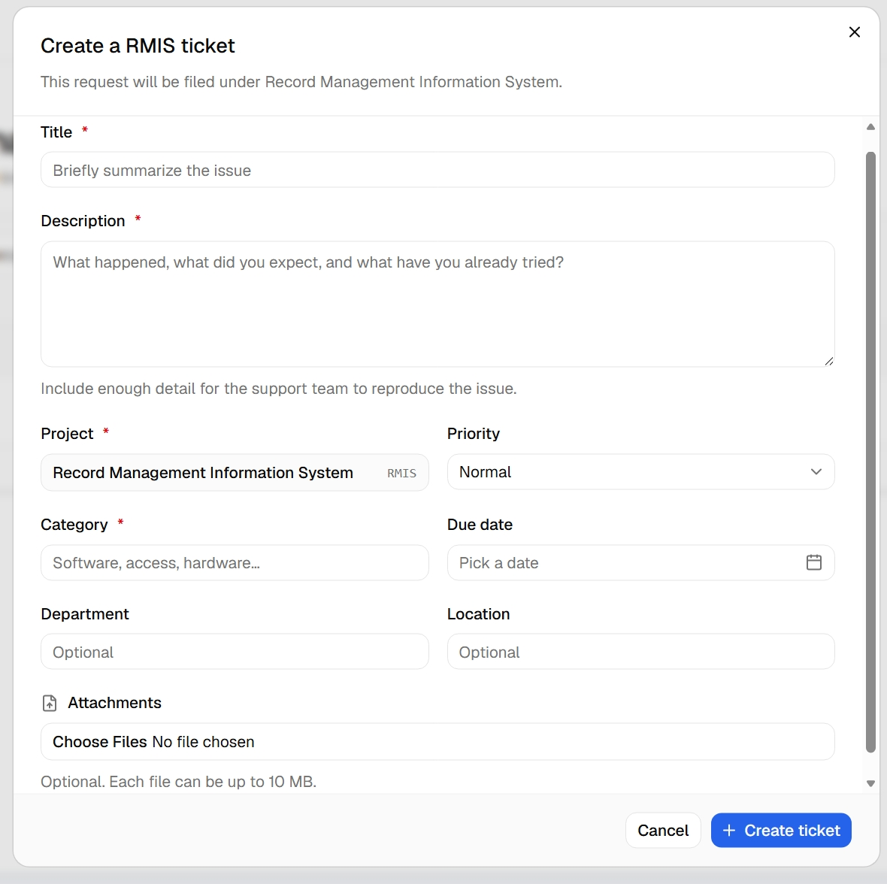
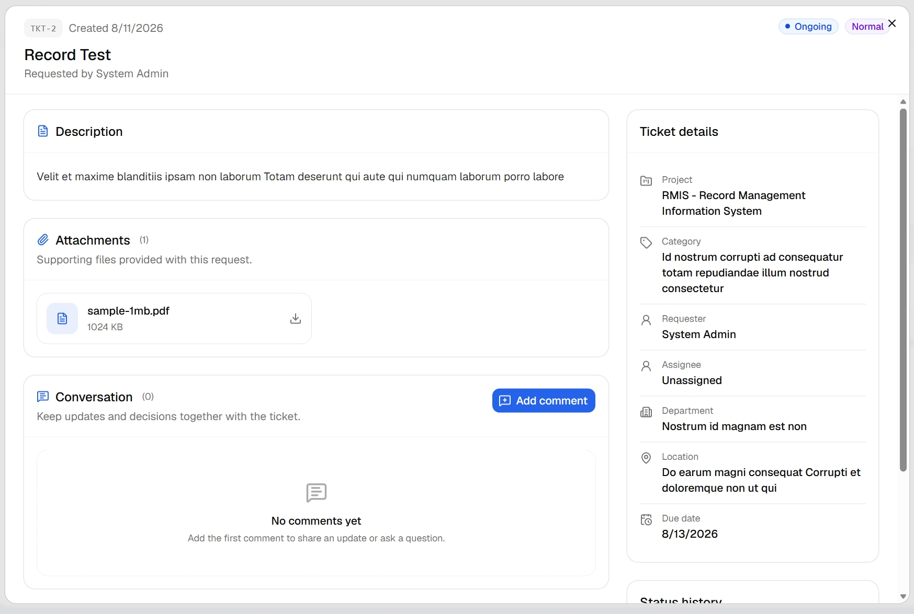

# Ticketing API v1

For project registration synchronization and automatic ticket creation, see [Project-to-Ticketing integration](./project-ticketing-integration.md).

The Ticketing API supports server-to-server ticket creation using user-owned API keys. Keep API keys in the calling project's backend or secret manager; never embed them in browser or mobile application code.

## Authentication

Create an API key from **Settings → API keys** while signed in to Ticketing. The raw key is shown once and has this general format:

```text
qtk_live_<random-secret>
```

Send the complete key in the `Authorization` header:

```http
Authorization: Bearer qtk_live_<random-secret>
```

API keys act as their owning Ticketing user. Revoked or expired keys, disabled users, unapproved users, and users without access to the requested project are rejected. Project permissions are checked from the database on every request.

### Development seed bearer (no expiry)

For local development or a controlled non-production environment, `scripts/seed.ts` can create a lifetime API key for the seeded admin. Add a generated `qtk_live_...` value to the Ticketing environment before running the seed:

```env
SEED_API_KEY=qtk_live_<43-url-safe-random-characters>
```

```bash
pnpm db:seed
```

The key is stored only as a hash, has no expiry, and is created idempotently. Use the same `SEED_API_KEY` value in requests:

````http
Authorization: Bearer qtk_live_<your-seed-api-key>
```

Do not use a permanent seeded key in production. For production integrations, create a scoped user key from **Settings → API keys** and rotate it regularly.

## Per-project backend setup

Every project backend uses the same Ticketing API host and a `qtk_live_...` user API key. Set these values in the backend environment only; do not expose them to the project web application.

```env
TICKETING_API_URL=https://ticketing.quanbyit.com
SEED_API_KEY=qtk_live_<project-backend-api-key>
````

Use the project code that matches the Ticketing project record:

| Project system                       | Ticketing project code | Ticket endpoints begin with |
| ------------------------------------ | ---------------------- | --------------------------- |
| Record Management Information System | `RMIS`                 | `/api/v1/projects/RMIS`     |
| QLegal                               | `QLEGAL`               | `/api/v1/projects/QLEGAL`   |
| Document Management System           | `DMS`                  | `/api/v1/projects/DMS`      |
| CIvil Registry Information System    | `CRIS`                 | `/api/v1/projects/CRIS`     |
| Human Resource Information System    | `HRIS`                 | `/api/v1/projects/HRIS`     |
| Learning Management System           | `LMS`                  | `/api/v1/projects/LMS`      |

The API key owner must have access to that Ticketing project. Create and activate a project in Ticketing before connecting its backend. The seed script includes the project codes above; run `pnpm db:seed` after updating an existing development database.

## Embed the full Ticketing experience in another project

Use this implementation contract when adding Ticketing to RMIS, QLEGAL, DMS, CRIS, HRIS, LMS, or another project. The goal is to reproduce the Ticketing workspace inside that project so users do not need to open the Ticketing application separately.

### Architecture requirements

1. Create a project web route such as `/ticketing` and add it to that project's authenticated sidebar.
2. The browser calls only that project's backend routes, for example `/api/v1/ticketing/tickets`.
3. The project backend calls Ticketing with `TICKETING_API_URL` and `SEED_API_KEY`. Never expose `SEED_API_KEY` or any `qtk_live_...` value in browser code.
4. Lock the backend integration to the correct project code. RMIS uses `RMIS`; QLegal uses `QLEGAL`; DMS uses `DMS`; CRIS uses `CRIS`; HRIS uses `HRIS`; LMS uses `LMS`.
5. Recheck the current Ticketing project access on every Ticketing API request. Do not cache authorization decisions.

### Required design references

Reproduce these three reference screens as closely as possible in the host project. Use the host project's shadcn components, spacing scale, typography, responsive breakpoints, and icon library, but preserve the information hierarchy, field order, and interaction design shown below.

#### Ticket table


- Header: project-code pill, ticket count, project title/description, and a primary **New {CODE} ticket** button.
- Table toolbar: search field, status filter, priority filter, and result count.
- Columns: ticket number/title, requester, category, status, priority, created date, and trailing action-menu icon.
- Status and priority are colored shadcn Select controls. The menu must open below the trigger and never cover it.
- The trailing ellipsis menu contains **View**, **Edit**, and destructive **Delete**.
- Footer includes result count and pagination.

#### Create-ticket dialog



- Large scrollable dialog with a fixed header and fixed footer.
- Header identifies the project and its human-readable title.
- Fields in order: title, description, locked project display, priority Select, category, due-date picker, department, location, and attachments.
- Use a two-column layout for project/priority, category/due date, and department/location on desktop; stack on mobile.
- Attachments are optional; show selected files.
- Footer has secondary **Cancel** and primary **Create ticket** actions.

#### Ticket-details dialog



- Full-width scrollable dialog with ticket number, created date, title/requester, and status/priority badges in the header.
- Main content uses a responsive two-column layout: description, attachments, and conversation on the left; ticket details and scrollable status history on the right.
- Attachment rows show icon, filename, size, and View/Download action; fetch files through the host backend proxy, never via S3 URLs.
- Conversation supports Add comment, nested replies, comment/reply attachments, and permitted edit/delete actions.
- Detail values include project, category, requester, assignee, department, location, and due date. Refresh after status changes so the automatic assignee is visible.

### Required UI

Build the following user experience in the host project:

- A ticket table with search, status and priority filters, pagination, status/priority dropdowns, a refresh strategy, and an action-menu icon in every row.
- The action-menu icon must open a shadcn DropdownMenu with **View**, **Edit**, and **Delete** actions. View opens the ticket-details dialog, Edit opens the edit-ticket dialog, and Delete opens a typed confirmation dialog before calling the DELETE endpoint.
- A **Create ticket** dialog with title, description, priority, category, department, location, due date, and file attachments.
- A ticket-details dialog showing status, priority, requester, project, assignee, description, attachments, and status history.
- A conversation section supporting comments, replies to any comment, edit/delete for permitted comments, and comment attachments.
- A confirmation dialog before changing a ticket to `done`.
- Ticket status/priority badges that match Ticketing's colors and labels.

### Backend proxy endpoints to implement

The host project should expose these authenticated routes to its own web app, then proxy them to the matching Ticketing paths. Replace `{CODE}` with the project's fixed code, such as `RMIS`.

| Host-project route                                                                      | Ticketing route                                                                               |
| --------------------------------------------------------------------------------------- | --------------------------------------------------------------------------------------------- |
| `GET /api/v1/ticketing/tickets`                                                         | `GET /api/v1/projects/{CODE}/tickets`                                                         |
| `POST /api/v1/ticketing/tickets`                                                        | `POST /api/v1/projects/{CODE}/tickets`                                                        |
| `GET/PATCH/DELETE /api/v1/ticketing/tickets/:ticketId`                                  | `GET/PATCH/DELETE /api/v1/projects/{CODE}/tickets/:ticketId`                                  |
| `GET/POST /api/v1/ticketing/tickets/:ticketId/comments`                                 | `GET/POST /api/v1/projects/{CODE}/tickets/:ticketId/comments`                                 |
| `PATCH/DELETE /api/v1/ticketing/tickets/:ticketId/comments/:commentId`                  | `PATCH/DELETE /api/v1/projects/{CODE}/tickets/:ticketId/comments/:commentId`                  |
| `GET /api/v1/ticketing/tickets/:ticketId/attachments`                                   | `GET /api/v1/projects/{CODE}/tickets/:ticketId/attachments`                                   |
| `GET /api/v1/ticketing/tickets/:ticketId/attachments/:attachmentId`                     | `GET /api/v1/projects/{CODE}/tickets/:ticketId/attachments/:attachmentId`                     |
| `GET /api/v1/ticketing/tickets/:ticketId/comments/:commentId/attachments`               | `GET /api/v1/projects/{CODE}/tickets/:ticketId/comments/:commentId/attachments`               |
| `GET /api/v1/ticketing/tickets/:ticketId/comments/:commentId/attachments/:attachmentId` | `GET /api/v1/projects/{CODE}/tickets/:ticketId/comments/:commentId/attachments/:attachmentId` |

Use `parentCommentId` in the comment `POST` body to create a reply. A `PATCH` ticket request can update `title`, `description`, `status`, `priority`, `category`, `department`, `location`, and `dueDate`.

### Authenticated file uploads

Authenticated Ticketing users can upload files from another project's Ticketing UI. The host backend must proxy the multipart request with the authenticated user's Ticketing Bearer key; the browser must never receive S3 credentials or upload directly to Ticketing S3.

| Purpose                                           | Method and Ticketing endpoint                                                      |
| ------------------------------------------------- | ---------------------------------------------------------------------------------- |
| Add a ticket attachment                           | `POST /api/v1/projects/{CODE}/tickets/{ticketId}/attachments`                      |
| Add an attachment to the user's own comment/reply | `POST /api/v1/projects/{CODE}/tickets/{ticketId}/comments/{commentId}/attachments` |

Send `multipart/form-data` with a single `file` field. Ticket uploads require project access; comment uploads additionally require the caller to own the comment unless the caller is an administrator.

```bash
curl --request POST \
  --url "https://ticketing.quanbyit.com/api/v1/projects/RMIS/tickets/{ticketId}/attachments" \
  --header "Authorization: Bearer $TICKETING_USER_API_KEY" \
  --form "file=@./supporting-document.pdf"
```

Do not set a manual `Content-Type` header when sending `FormData`; the HTTP client must set the multipart boundary.

### Attachment listing and secure fetch

The host-project ticket-details dialog and comment thread can fetch attachment metadata and files through these authenticated Ticketing API routes. Proxy them through the host backend:

| Method | Ticketing endpoint                                                                           | Result                                          |
| ------ | -------------------------------------------------------------------------------------------- | ----------------------------------------------- |
| `GET`  | `/api/v1/projects/{CODE}/tickets/{ticketId}/attachments`                                     | List ticket-level attachments                   |
| `GET`  | `/api/v1/projects/{CODE}/tickets/{ticketId}/attachments/{attachmentId}`                      | Stream or download one ticket attachment        |
| `GET`  | `/api/v1/projects/{CODE}/tickets/{ticketId}/comments/{commentId}/attachments`                | List attachments on a comment or reply          |
| `GET`  | `/api/v1/projects/{CODE}/tickets/{ticketId}/comments/{commentId}/attachments/{attachmentId}` | Stream or download one comment/reply attachment |

The browser should open the host project's authenticated download route, not an S3 URL. The host backend validates its session, calls Ticketing with the Bearer credential, and streams the response with the original filename and MIME type. Never return presigned S3 URLs, AWS credentials, or bucket paths to the browser.

These endpoints stream private S3 content through Ticketing after checking the API key owner's current project access. Other projects can now render attachment rows and View/Download actions without sending users to the Ticketing web application.

### Table status and priority behavior

To match Ticketing, render `status` and `priority` as shadcn Select controls in the host-project ticket table. Updating either value calls:

```http
PATCH /api/v1/projects/{CODE}/tickets/{ticketId}
Authorization: Bearer qtk_live_<user-api-key>
Content-Type: application/json
```

```json
{ "status": "ongoing", "priority": "high" }
```

When the authenticated Ticketing user changes status to `ongoing` or `done`, Ticketing automatically assigns that user to the ticket. Refresh the host-project table and details dialog after the PATCH response so the new assignee is shown.

Before sending `{ "status": "done" }`, display a modal that requires the user to type `CONFIRM` and provides a copy button for that word. Once confirmed, call the PATCH endpoint. Ticketing records the status-history event, assigns the authenticated user, and sends the completion notification.

### Copy-ready implementation prompt

```text
Add a Ticketing workspace to this project at /ticketing and include it in the authenticated app sidebar.

Use this Ticketing configuration only from the backend:
TICKETING_API_URL=<Ticketing host>
SEED_API_KEY=<qtk_live API key>

This project code is {CODE}. Hard-code that code in the backend Ticketing client; never accept it from the browser.

Create backend proxy endpoints for Ticketing ticket CRUD and comment/reply CRUD. The browser must call only this project's backend, never Ticketing directly and never receive the Bearer key.

Build the UI to match Ticketing: searchable/filterable ticket table; shadcn status and priority Select controls; a shadcn action-menu icon on every row with View, Edit, and Delete; Create ticket modal; ticket detail modal with status history and assignee; comments and nested replies; edit/delete actions; and a typed confirmation before setting status to Done. When a user sets Ongoing or Done, refresh the row and details because Ticketing automatically assigns that authenticated user. Use Ticketing's status and priority colors.

Use the visual references in `docs/Table UI.jpeg`, `docs/Create-ticket.jpeg`, and `docs/view-ticket.jpeg` as the required design specification. Match their information hierarchy, dialog layout, controls, cards, attachment rows, and status-history presentation.

Use the Ticketing API paths documented in docs/api.md. Proxy multipart uploads through this project's backend using the Ticketing attachment endpoints. Do not upload files directly to S3 and do not expose the Ticketing Bearer key.
```

## Create a project ticket

```http
POST /api/v1/projects/{projectCode}/tickets
Authorization: Bearer <user-api-key>
Content-Type: application/json
```

Project codes are case-insensitive and normalized to uppercase. Examples:

```text
POST /api/v1/projects/RMIS/tickets
POST /api/v1/projects/QLEGAL/tickets
```

Request body:

```json
{
  "title": "Unable to archive record",
  "description": "Archiving the record returns an error.",
  "priority": "normal",
  "category": "Software",
  "department": "Records",
  "location": "Main Office",
  "dueDate": "2026-08-20"
}
```

`priority` accepts `low`, `normal`, or `high`. Optional fields may be omitted. The API always derives the project from the URL and the requester from the API key; it does not accept caller-controlled `projectId`, `requesterId`, `status`, or `assigneeId` values.

Example request:

```bash
curl --request POST \
  --url "https://ticketing.quanbyit.com/api/v1/projects/RMIS/tickets" \
  --header "Authorization: Bearer $TICKETING_API_KEY" \
  --header "Content-Type: application/json" \
  --data '{
    "title": "Unable to archive record",
    "description": "Archiving the record returns an error.",
    "priority": "normal",
    "category": "Software"
  }'
```

The JSON endpoint does not accept attachments. Add files through Ticketing after creation until a multipart attachment endpoint is introduced.

## Read, update, and delete tickets

All ticket operations use the same user API key and require the key owner to have current access to `{projectCode}`.

| Method   | Endpoint                                            | Purpose                                             |
| -------- | --------------------------------------------------- | --------------------------------------------------- |
| `GET`    | `/api/v1/projects/{projectCode}/tickets?limit=50`   | List up to 100 project tickets, newest update first |
| `GET`    | `/api/v1/projects/{projectCode}/tickets/{ticketId}` | Get one ticket                                      |
| `PATCH`  | `/api/v1/projects/{projectCode}/tickets/{ticketId}` | Update editable ticket fields                       |
| `DELETE` | `/api/v1/projects/{projectCode}/tickets/{ticketId}` | Delete a ticket; returns `204`                      |

Example update:

```http
PATCH /api/v1/projects/QLEGAL/tickets/9a73e5fa-0ee0-4db1-a449-4608f1240c9c
Authorization: Bearer qtk_live_<user-api-key>
Content-Type: application/json
```

```json
{
  "status": "ongoing",
  "priority": "high",
  "dueDate": "2026-08-20"
}
```

`PATCH` accepts any combination of `title`, `description`, `status` (`pending`, `ongoing`, `done`), `priority`, `category`, `department`, `location`, and `dueDate`. Ticket status changes are recorded in the status history. It does not accept a different requester, project, or assignee.

## Comments and replies

Comments use the same project and ticket path. A reply is a comment with `parentCommentId`; replies can themselves be replied to, producing a single nested conversation chain.

| Method   | Endpoint                                                                 | Purpose                                                                |
| -------- | ------------------------------------------------------------------------ | ---------------------------------------------------------------------- |
| `GET`    | `/api/v1/projects/{projectCode}/tickets/{ticketId}/comments`             | List comments in chronological order                                   |
| `POST`   | `/api/v1/projects/{projectCode}/tickets/{ticketId}/comments`             | Add a comment or reply                                                 |
| `PATCH`  | `/api/v1/projects/{projectCode}/tickets/{ticketId}/comments/{commentId}` | Edit your own comment; admins may edit any comment                     |
| `DELETE` | `/api/v1/projects/{projectCode}/tickets/{ticketId}/comments/{commentId}` | Delete your own comment and its replies; admins may delete any comment |

Create a root comment:

```json
{
  "body": "We have applied the requested fix. Please verify it."
}
```

Reply to an existing comment:

```json
{
  "body": "Confirmed, thank you.",
  "parentCommentId": "9a73e5fa-0ee0-4db1-a449-4608f1240c9c"
}
```

Comment endpoints accept JSON only. Attachment upload is not yet available through the API.

## Automatic ticket creation from any project

An integrated project does not need each user to generate a personal key. The project backend stores the integration key and uses its project code after it identifies the signed-in user:

```http
POST /api/v1/integrations/{projectCode}/tickets
Authorization: Bearer <TICKETING_TICKET_API_KEY>
Content-Type: application/json
```

The body is the same as the project ticket body, plus the authenticated user's email. The project backend must derive that email from its server-side session, never trust an email supplied directly by the browser:

```json
{
  "requesterEmail": "juan@example.com",
  "title": "Unable to archive record",
  "description": "Archiving the record returns an error.",
  "priority": "normal",
  "category": "Software"
}
```

Ticketing resolves that email to its own account and only creates the ticket when the user is active, approved, and has the route project's access. Configure the global secret as `TICKETING_TICKET_API_KEY` in Ticketing and use the same value as `TICKETING_TICKET_API_KEY` in each approved project backend.

## Account provisioning credential

`TICKETING_PROVISIONING_TOKEN` is a separate server-to-server credential used only by account synchronization endpoints. It cannot authenticate ticket API requests and must not be issued to users.
